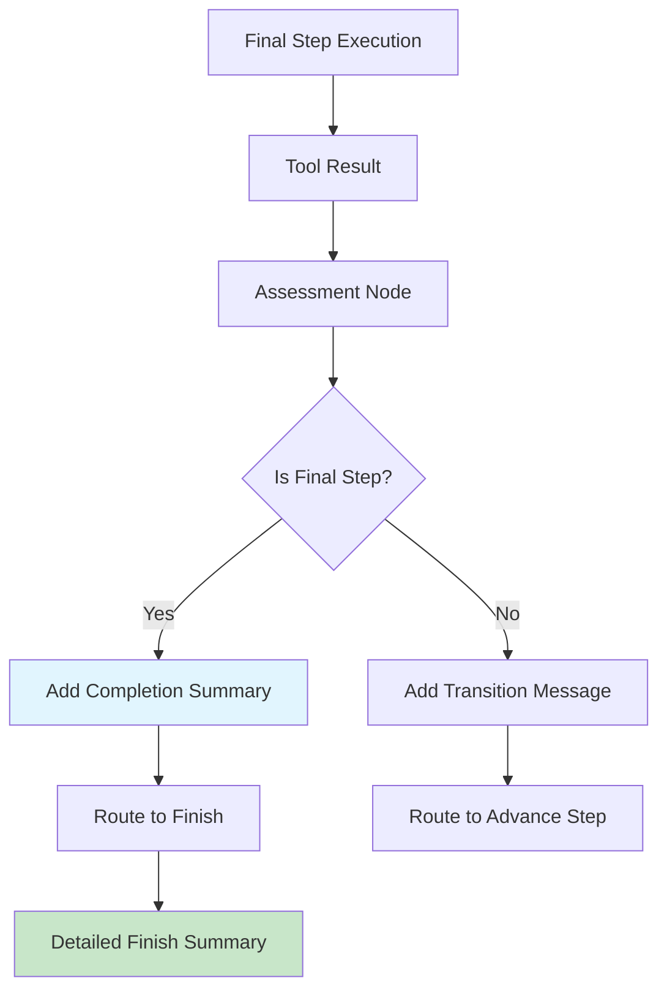

# Pre-Finish Completion Pattern Implementation

## How the Pattern Works



## Message Flow Example

### Before Fix (Repetitive):
```
User: "Create a player controller script"

Agent: "I'll search for Unity controller best practices..."
[Tool Call: search]

Agent: "I'll analyze your project structure..."  
[Tool Call: get_project_info]

Agent: "I'll get code templates..."
[Tool Call: get_script_snippets]

Agent: "I'll write the script file..."
[Tool Call: write_file]

Agent: "Task completed. Here's a summary of what was implemented..."
```

### After Fix (Professional Pattern):
```
User: "Create a player controller script"

Agent: "I'll search for Unity controller best practices..."
[Tool Call: search]

Agent: "Building on the research, I'll analyze your project..."
[Tool Call: get_project_info]

Agent: "Using the project context, I'll get code templates..."
[Tool Call: get_script_snippets]

Agent: "Perfect! Now I'll implement the controller script..."
[Tool Call: write_file]

Agent: "Perfect! I've successfully created a complete character controller script for you. The script uses the legacy Input system for immediate compatibility."

Agent: "## What was accomplished:
✅ **Step 1:** Search for current best practices...
✅ **Step 2:** Get current project information...
[Detailed technical breakdown]"
```

## Key Implementation Points

### 1. Detection Logic in assess.py
```python
if assessment.outcome == "success":
    next_index = state.step_index + 1
    is_final_step = next_index >= len(state.plan.steps)
    
    if is_final_step:
        # Add concise completion summary
        completion_summary = _create_completion_summary(state, state.plan.goal)
        messages_to_add.append(AIMessage(content=completion_summary))
```

### 2. Goal-Based Summary Generation
The completion summary adapts based on goal analysis:
- **Script creation**: "Perfect! I've successfully created a complete character controller script..."
- **Asset creation**: "Perfect! I've successfully created the requested game asset..."
- **Bug fixing**: "Perfect! I've identified and fixed the main issue..."
- **Configuration**: "Perfect! I've successfully configured all the requested project settings..."

### 3. Two-Phase Summary Approach
- **Phase 1 (assess.py)**: Concise, action-focused completion
- **Phase 2 (finish.py)**: Detailed technical breakdown with next steps

## Benefits of This Pattern

1. **Professional Feel**: Matches behavior of other high-quality agents
2. **Clear Success Signal**: User immediately knows the task succeeded
3. **Context Awareness**: Summary reflects actual work done
4. **Smooth Transition**: Natural flow from completion to detailed summary
5. **Goal-Specific**: Different summaries for different types of tasks

## Files Modified

- **assess.py**: Added completion detection and summary generation
- **finish.py**: Enhanced to provide complementary detailed summary
- **plan.py**: Fixed Pydantic import for deprecation warning